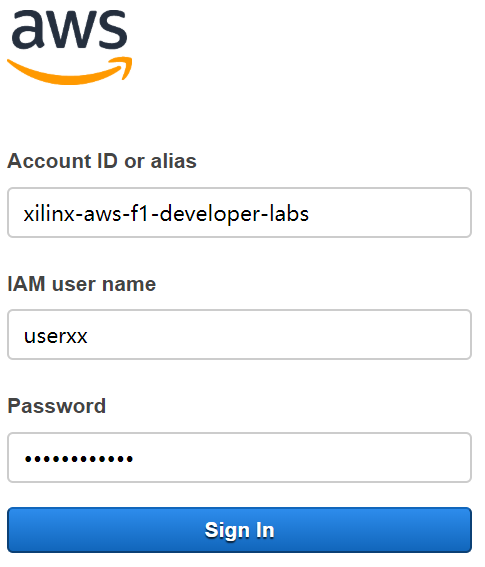
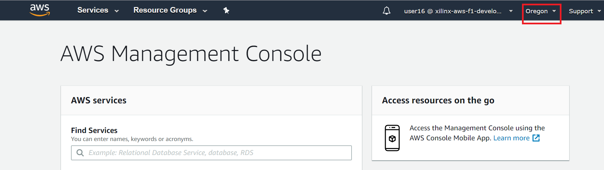
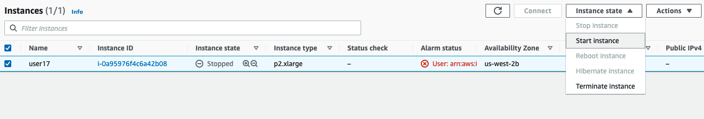
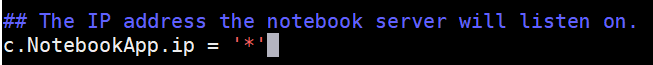
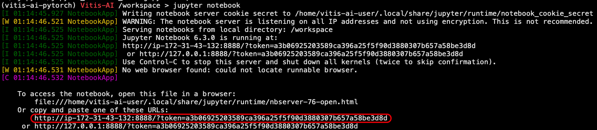
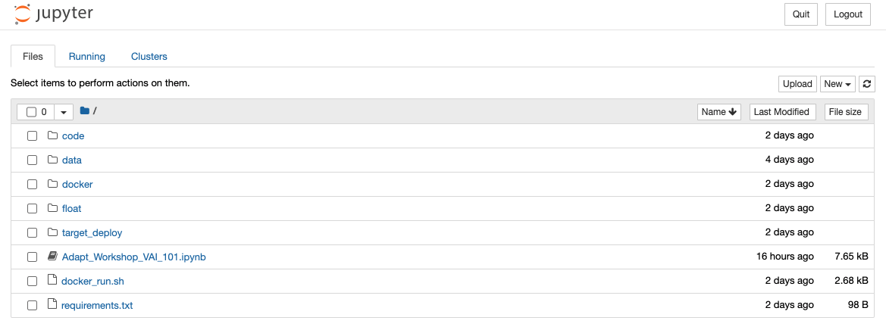
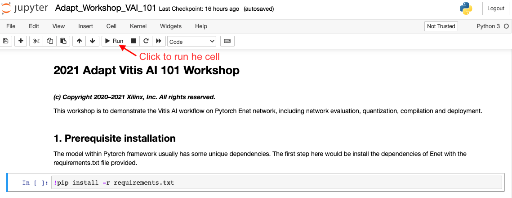
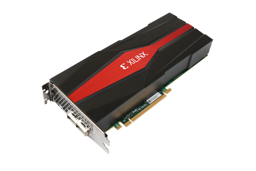

# **Adapt2021_Workshop_VAI101**

## **Introduction:**

Welcome to the Adapt 2021 Vitis AI 101 workshop. In this session, you will gain hands-on experience on AWS with the Vitis AI 1.4 version to quantize and compile a Pytorch model that utilizes Xilinx® Deep Learning Processor(DPU) on KV260 / U50 / VCK5000 to accelerate machine learning algorithms. The ENet model trained with public Cityscapes datasets will be applied as an example in this lab.

## **Connecting to your P2 instance**

In this module you will start an EC2 P2 instance and connect to it using SSH or remote desktop client. Once connected, you will be able to use the tool with all needed scripts and dataset. For this event, each registered participant will be required to start an EC2 P2 instance, therefore, participants need to have experience with:

-   AWS account and launching EC2 instances

-   Connecting to a running instance using SSH or Windows Remote Desktop

## **Log in to AWS and start the instance**

The AWS environment <https://aws.amazon.com> is applied for this lab. Each user
will be assigned a specific username and unified password for sign in.

*Account ID: xilinx-aws-f1-developer-labs*

*IAM User name: userXX*

*Password: xlnx_adapt2021*



After signing in, you may find the following page, and please check if the region has already been set to **US West (Oregon)** at top right corner before entering the next step.



Then, please click **Services \> EC2 \> Instances** on the top left corner and you will see a list of instances. Select the instance associated with your user name, click **Actions \> Instance State \> Start instance.**



The startup time is about 20 \~30 seconds and you need to refresh the browser to see the status update. You will see the instance state becomes running and there
is an **IPv4 public IP** address associated with it. Later, you will use this IP address for SSH or Remote Desktop Connection to access the working directory.


## **Connect to your instance using SSH**

In the SSH client such as PuTTy, use the IPv4 Public IP of your instance:

>   *ssh ubuntu\@\<your IPv4 Public IP\>*

For the first time, it may ask you for the username and password, please use:

Username: ubuntu

Password: xlnx_adapt2021

## **Enter Docker Environment**

The Vitis AI is released in the format of docker container. Please enter the docker container of Vitis AI 1.4 for this workshop

>   *cd Workshop_VAI_101*

>   *sudo ./docker_run.sh xilinx/vitis-ai-gpu:latest*

The docker container will start and you should see something like this in the terminal:


```shell
==========================================

__      ___ _   _                   _____
\ \    / (_) | (_)            /\   |_   _|
 \ \  / / _| |_ _ ___ ______ /  \    | |
  \ \/ / | | __| / __|______/ /\ \   | |
   \  /  | | |_| \__ \     / ____ \ _| |_
    \/   |_|\__|_|___/    /_/    \_\_____|

==========================================

Docker Image Version:  latest
Build Date: 2021-05-06
VAI_ROOT: /opt/vitis_ai

For TensorFlow 1.15 Workflows do:
     conda activate vitis-ai-tensorflow
For Caffe Workflows do:
     conda activate vitis-ai-caffe
For Neptune Workflows do:
     conda activate vitis-ai-neptune
For PyTorch Workflows do:
     conda activate vitis-ai-pytorch
For TensorFlow 2.3 Workflows do:
     conda activate vitis-ai-tensorflow2
For Darknet Optimizer Workflows do:
     conda activate vitis-ai-optimizer_darknet
For Caffe Optimizer Workflows do:
     conda activate vitis-ai-optimizer_caffe
For TensorFlow 1.15 Workflows do:
     conda activate vitis-ai-optimizer_tensorflow
For LSTM Workflows do:
     conda activate vitis-ai-lstm
Vitis-AI /workspace >
```

## **Enter Anaconda Environment**

The anaconda is applied to setup an isolated environment for different model framework. The following command need to be applied for this workshop:

>   *source activate vitis-ai-pytorch*

## **Jupyter Notebook**

The Jupyter Notebook will be applied for the part of Vitis AI tool flow. Please use the following command to configure it.

>   jupyter-notebook --generate-config

>   vim /home/vitis-ai-user/.jupyter/jupyter_notebook_config.py

Change Jupyter configuration at **line 210** to allow external IP access.
Then, use the following command to start it.



>   *jupyter notebook*

Please copy the link into the browser, and change the IP address to *\<your IPv4 Public IP\>,*



Then you will see the window as follow:



Enter the ~/pt_ENet_cityscapes_512_1024_8.6G_1.4/ folder and double click the **Adapt_VAI101_workshop.ipynb** file to start the lab.

### *More about Jupyter Notebook*

Jupyter notebook is an environment that combining codes with inline instructions. The user could simply click the run button in front of the code
section to execute it rather than type commands manually. The output will be printed out when finished. Please run the code block in sequence *NOT in parallel*.

There will be a star in the brackets when the code block is running. Please wait patiently until it finishes. The star will turn to a number when it finishes and you may jump to the next one. 

Please follow the instructions in the Jupyter notebook until the Enet_int.xmodel file is generated.



## **Model Deployment**

Welcome back! In this section, The deployment flow with KV260, U50 and VCK5000 will shown as below. User can choose freely based on the hardware you are using. 

### *KV260 Setup*:
User need to prepare a **16GB SD card** which will hold the boot image and necessary demo files has been provided as the boot device. User need to connect a **Serial Cable** between the host and board to set the IP address and an **Ethernet Cable** to download the xmodel and corresponding files for inference from host. User can find the KV260 board image file from the link below:

[KV260 Board Image](https://www.xilinx.com/member/forms/download/design-license-xef.html?filename=xilinx-kv260-dpu-v2020.2-v1.4.0.img.gz)

<p align="left">

</p>

* Use Etcher software to burn the image file onto the SD card.

* Insert the SD card with the image into the destination board.

* Plug in the power and boot the board using the serial port to operate on the system.

* Set up the IP information of the board using the serial port. The following instruction is assumed the board IP is set to **192.168.0.26**

**For the details, please refer to [Setting Up the Evaluation Board](https://www.xilinx.com/html_docs/vitis_ai/1_4/installation.html#yjf1570690235238)**

### *U50 Setup*:
For all the alveo cards, Xilinx has provided the script to allow the users to complete the setup with a single run. Please follow [Setup Alveo Accelerator Card](https://github.com/Xilinx/Vitis-AI/tree/master/setup/alveo) to install the prerequisite and enter the docker container. Then executed the following commands to finish the setup.

	```
	cd /workspace/setup/alveo
	source setup.sh DPUCAHX8H
	```
 
<p align="left">

</p>

### *VCK5000 Setup*:
For VCK5000, Xilinx has provided the script as well to allow the users to complete the setup with a single run. Please follow [Setup VCK5000 Card](https://github.com/Xilinx/Vitis-AI/tree/master/setup/vck5000) to install the prerequisite and enter the docker container. Then executed the following commands to finish the setup.
 


### *Running Example*:
User can use either **scp** command or [File Zila](https://filezilla-project.org/) to copy the **target_deploy** folder from AWS to your hardware environment. The transmisstion to KV260 will be shown as an example here. To complete the transfer, two steps are required. Firstly, we need to copy the **target_deploy** folder from Cloud to the host, then copy from host to KV260 board. 

On your host environment, please use terminals like **Tera Term** or **MobaXterm** to complete the transmission. Simply do:

>   scp -r ubuntu@<your IPv4 Public IP\>:~/Workshop_VAI_101/target_deploy .

>   scp -r target_deploy root@192.168.0.26:~/

**Note:** Remember to change the *<your IPv4 Public IP\>* to the real IP address

Then log on to the board with the following command

>   *ssh* root@192.168.0.26

User may want to rebuild the project by type:

>   cd target_deploy

>   sh build.sh

the final executable file ./test_jpeg_segmentation will be generated. Run the executables on Xilinx embedded platform to see the visual output.

>   ./test_jpeg_segmentation ENet_cityscapes_pt sample_segmentation.jpg

<p align="left">

</p>

## **Summary**:

The attendees of VAI_101 lab will experience the end to end deployment flow from a Pytorch model to DPU instructions and finally running on the selected hardware platform. The key takeaways would be summarized as follow:

1) Quantization flow followed by evaluation progress.
2) Compilation with assigned hardware platform.
3) Unified software toolchain when swiching the platform.
